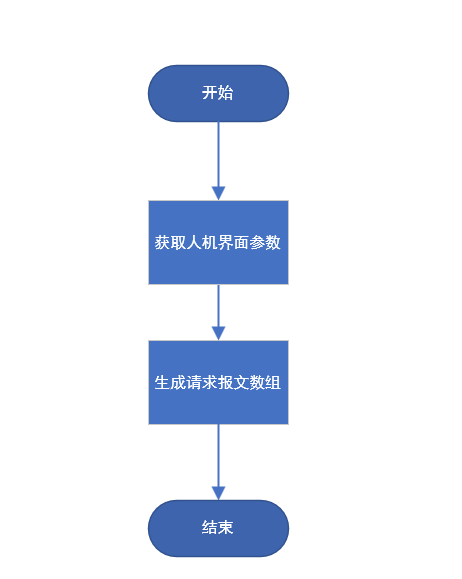

# ModBus项目方案书

##  一 . 项目背景

ModBus是工业自动化的常用协议，学习该协议是从事自动化相关行业的必经之路。而自主实现ModBus协议可以帮助学习者完善所学知识，更深层次的全面理解并掌握该协议，发现并弥补学习的漏洞。

## 二 .技术点验证

**QT串口通信验证**

​		QT 的串口通信，QT为我们提供了一个用于串口通信的类QSerialPort，该类可以帮助我们实现串口通信，在QT中我编写了一个案例验证了是可以实现串口通信的。

​		首先是创建一个QSerialPort对象，然后调用对应的方法设置串口号等参数，例如调用setPortName方法设置端口号。当串口成功打开后，QSerialPort对象会监听IO口是否有数据，当有数据时会发出readyRead信号，我们只需要编写一个槽去接收即可，当向串口写入数据时，我们只需要调用QSerialPort对象的write方法即可。

**QT网络通信验证**

​		QT 的网络通信，在Qt中提供了QTcpSocket类来编写客户端程序，使用QTcpServer类编写服务器端程序。我们在服务器端进行端口的设置，一旦发现客户端的连接请求，就会发出newConnection()信号，可以关联这个信号到我们自己的槽进行数据的读取和发送。而在客户端，一旦有数据到来就会发出readyRead()信号，可以关联此信号进行数据的接收。

## 三. 流程图

### RTU主站

#### 主要流程

#### 1. 串口

串口检测:

##### 1.1 串口开关

串口开启：

串口关闭：

##### 1.2 串口断开

串口断开：

#### 2.报文处理

主要流程：

##### 请求报文生成

0x01 和 0x03报文生成

0x0f 和 0x10

##### 响应报文解析

异常响应报文解析

正常报文解析

#### 3.消息日志

##### 3.1消息日志写入

###### 定时写入：

###### 关闭程序写入：

##### 3.2消息日志查看

#### 4.数据

##### 4.1数据显示

##### 4.2数据搜索

### RTU从站

#### 主要流程：

#### 1. 串口打开和关闭模块

#### 1.1 串口打开模块

- 内容：

  - 获取界面参数

  - 设置本机地址和串口号
  - 打开串口
  - 如果打开成功，则依次设置波特率、数据位、停止位、校验位，输出成功提示信息
  - 如果失败输出失败提示

- 流程图：

  

#### 1.2 串口关闭模块

- 内容：

  - 调整串口状态为关闭
  - 清空缓存区
  - 关闭、清除串口
  - 提示关闭信息
  
- 流程图：

  

#### 1.3. 串口断开检测模块

- 内容：

  - 获取串口断开错误
  - 提示断开信息
  - 执行串口关闭模块

- 流程图：

  

#### 2. ModBus报文处理模块

#### 2.1 解析请求报文模块

- 内容：

  - 分析报文合法性，分析出公共数据项
  - 显示收到的报文
  - 解析报文：判断CRC校验码、从站地址、功能码
  - 错误显示错误信息
  - 正确则按功能码进行深层解析

- 流程图：

  

#### 2.1.1 功能码0X01和0X03请求报文解析

- 内容：

  - 判断请求帧长度合法性
  - 判断请求报文的起始地址合法性、数量项合法性、该起始地址能否读取请求数量的线圈
  - 异常发送异常响应报文
  - 正常发送正常响应报文

- 流程图：

  

#### 2.1.2 功能码0X0F请求报文解析

- 内容：

  - 判断请求报文的起始地址合法性、数量项合法性、该起始地址能否写入请求数量的线圈、字节数字段正确性、字节字段长度是否匹配
  - 异常发送异常响应报文
  - 正常则将线圈写入线圈数据表，并更新ini文件，并发送正常响应报文

- 流程图：

  

#### 2.1.3 功能码0X10请求报文解析

- 内容：

  - 判断请求报文的起始地址合法性、数量项合法性、该起始地址能否写入请求数量的寄存器、字节数字段正确性、字节字段长度是否匹配
  - 异常发送异常响应报文
  - 正常则将线圈写入寄存器数据表，并更新ini文件，并发送正常响应报文

- 流程图：

  

#### 2.2 生成响应报文模块

#### 2.2.1 异常响应报文发送和显示

- 内容：

  - 通过异常响应报文数组构建得到异常响应报文
  - 发送响应报文
  - 显示异常类型
  - 显示异常响应报文

- 流程图：

  

#### 2.2.2 异常响应报文数组构建

- 内容：根据本机地址、功能码和异常码构建异常响应报文

- 流程图：

  

#### 2.2.3 正常响应报文发送和显示

- 内容：

  - 通过正常响应报文数组构建得到正常响应报文
  - 发送响应报文
  - 显示响应报文

- 流程图：

  

#### 2.2.4 正常响应报文数组构建

- 内容：根据功能码进行创建报文

- 流程图：

  

#### 4.  清除消息窗口模块

- 内容：

  - 对话框二次确认是否清除
  - 如果确认清除，清除消息窗口，并将数据保存到指定文件

- 流程图：

  

#### 4.  历史记录模块

#### 4.1 查看历史记录模块

- 内容：

  - 判断有无文件路径
  - 如果有文件路径则进入显示历史消息函数进行显示
  - 如果没有文件路径先弹出对话框进行选择路径
  - 如果选择路径为空则提示打开失败
  - 如果路径合法则提示成功，并进入显示历史消息函数进行显示

- 流程图：

  

#### 4.2.  历史记录写入文件模块

- 内容：

  - 判断有无文件路径
  - 如果有路径则将历史记录写入文件
  - 如果没有路径，则先使用文件选择对话框选择文件路径
  - 若选择的路径为空，提示打开失败
  - 若选择的路径合法，则路径设置成功，并将消息框的信息写入文件

- 流程图：

  

#### 5. 搜索线圈和寄存器模块

- 内容：

  - 获取用户线圈数据表搜索和寄存器数据表搜索的位置
  - 将数据表显示到该位置

- 流程图：

  

### TCP主站

#### 主要流程

#### 2 .  TCP连接和断开模块

#### 3. ModBus报文处理模块

##### 3.1 生成和发送请求报文模块

- 内容：

  - 判断用户输入的功能码，根据功能码进入对应的生成函数
  - 进行响应报文超时判断和超时重传

- 流程图：

  

##### 3.1.1 处理0X01和0X03请求报文

##### 3.1.2 处理0X0F和0X10请求报文

##### 3.2 解析响应报文

##### 3.2.1 报文合法性判断

##### 3.2.2 0X01和0X03功能码报文处理

##### 3.2.3 0X0F和0X10功能码报文处理

#### 4.  清除消息窗口模块

- 内容：

  - 对话框二次确认是否清除
  - 如果确认清除，清除消息窗口，并将数据保存到指定文件

- 流程图：

  

#### 5.  历史记录模块

##### 5.1 查看历史记录模块

- 内容：

  - 判断有无文件路径
  - 如果有文件路径则进入显示历史消息函数进行显示
  - 如果没有文件路径先弹出对话框进行选择路径
  - 如果选择路径为空则提示打开失败
  - 如果路径合法则提示成功，并进入显示历史消息函数进行显示

- 流程图：

  

##### 5.2.  历史记录写入文件模块

- 内容：

  - 判断有无文件路径
  - 如果有路径则将历史记录写入文件
  - 如果没有路径，则先使用文件选择对话框选择文件路径
  - 若选择的路径为空，提示打开失败
  - 若选择的路径合法，则路径设置成功，并将消息框的信息写入文件

- 流程图：

  

### TCP从站

#### 主要流程

#### 1.监听连接

#### 2.报文处理

##### 2.1请求报文解析

0x01 和 0x03 报文解析

0x0f 报文解析

0x10 报文解析

##### 2.2响应报文生成

正常报文生成

异常报文生成

#### 3.消息日志

##### 3.1消息日志写入

###### 定时写入：

###### 关闭程序写入：

##### 3.2消息日志查看

#### 4.数据

##### 4.1数据显示

##### 4.2数据搜索

