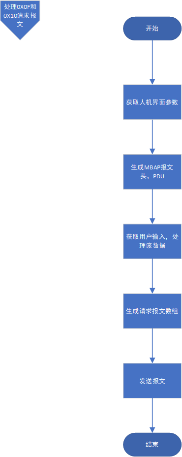

# ModBus项目方案书

##  一 . 项目背景

ModBus是工业自动化的常用协议，学习该协议是从事自动化相关行业的必经之路。而自主实现ModBus协议可以帮助学习者完善所学知识，更深层次的全面理解并掌握该协议，发现并弥补学习的漏洞。

## 二 . 目标
- 实现ModBus从站
	· 能够正常连接
	· 能够判断连接断开
	· 能够正确解析请求帧
	· 对于正确请求帧给出正确应答帧
	· 对于错误请求帧给出错误应答帧或按规格给出相应的处理
- 实现ModBus主站
	· 能够正常连接
	· 能够判断连接断开
	· 能够按要求生成请求帧
	· 能够正确解析应答帧，并做相应处理
	· 能够进行超时处理
	· 拥有美观易操作的人机界面

## 三. 核心需求分析

- RTU主站

  

- RTU从站

  1. 拥有美观易操作的人机界面

     - 可以方便的选择当前可用串口号、本机地址、波特率、数据位、停止位和奇偶校验位
     - 可以方便的进行串口的打开和关闭，并进行打开成功提示和关闭询问和提示
     - 可以方便的查看和搜索数据文件中的线圈和寄存器的地址和数据信息，并且在数据改变时要及时更新
     - 可以清晰的显示接收到的响应报文信息和处理信息，展示出何时何串口收到何种消息，并展示出处理信息
     - 可以保持显示界面的易读性，保证可以看到最新的消息，并且可以自主清理消息窗口
     - 可以方便的查看历史消息
  2. 进行串口打开
  
     - 能够获取用户选择的串口号、本机地址、波特率、数据位、停止位和奇偶校验位
     - 能够按照获取到的用户选择参数配置串口
     - 能够在串口成功打开或打开失败时给与提示信息
  3. 主动串口关闭处理

     - 能够判断用户是否是主动关闭串口
     - 能够对关闭以后的状态进行设置处理，使其整体回到串口打开前的状态，并且不影响下一次通信
  4. 被动串口关闭处理
     - 能够检测串口被动异常关闭，例如串口拔出
     - 当检测到被动串口关闭异常时，可以立即给出警告提示，并且能够对关闭以后的状态进行设置处理，使其整体回到串口打开前的状态，并且不影响下一次通信
  5. 正确解析请求帧
     - 能够接收请求帧，并对其进行合理的处理
     - 能够判断出请求报文的长度是否合法
     - 能够判断出请求报文的CRC校验码是否正确
     - 能够判断出请求报文的从站地址和本机地址是否匹配
     - 能够判断出请求报文的功能码项是否合法
     - 能够根据不同的功能码进行对应的解析
  6. 处理正确请求报文
     - 能够在请求报文正确无误时发送正常响应报文
  7. 处理异常或者错误请求报文
     - 对于错误请求帧给出错误应答帧或按规格给出相应的处理
  8. 数据和消息保存
     - 能够及时的更新本地数据文件，防止数据丢失
     - 能够将消息窗口的消息记录保存到指定文件，防止信息丢失，方便后续查阅
- TCP主站

  1. 拥有美观易操作的人机界面

     - 可以方便的设置IP地址和端口号，能够给出默认地址项
     - 可以方便的选择从机地址、功能码、起始地址和数量，并可以给出相应的范围提示保证用户输入合法值
     - 可以方便的进行TCP的连接与断开，并进行连接成功提示和断开询问和提示
     - 可以方便的进行请求报文的发送
     - 当用户选择写入功能码时，可以使用美观的对话框获取用户输入，并适当给与提示
     - 可以清晰的显示发送的请求信息和收到的响应信息，并显示出时间信息和地址信息
     - 可以保持显示界面的易读性，保证可以看到最新的消息，并且可以自主清理消息窗口
     - 可以方便的查看历史消息
  2. 进行TCP连接
  
     - 能够获得用户输入的目标IP地址、端口号、从机地址、功能码、起始地址和数量
  
     - 能够根据获取的用户参数连接目标IP
  
     - 能够在连接成功或失败时给出相应提示信息
  3. TCP断开

     - 能够判断用户主动断开TCP的行为，并且给与二次确认并进行提示
     - 能够自动检测TCP的被动异常断开状态，并立即给出警告提示
     - 能够对断开以后的状态进行设置处理，使其整体回到TCP连接前的状态，并且不影响下一次通信
  4. 生成请求报文
  
     - 能够将获得的用户数据转化为请求报文数据
     - 能根据不同的功能码类型生成请求报文，若为写入请求报文，能够正确获得用户输入，并进行处理转化为报文数据
  5. 发送请求报文
  
     - 能够判断发送时的TCP连接状态，若TCP为断开状态则不能发送，并给出提示，且能够将状态设置为TCP连接前的状态，使其不影响下一次通信
     - 能够进行超时响应，当从站在规定时间内无响应时，应启动超时响应，进行若干次的重发操作，并给出提示。当超出重发上限后应给出提示，并且能够将状态设置为TCP连接前的状态，使其不影响下一次通信
  6. 正确解析响应报文

     - 能够正确接收响应报文，并对其进行相应处理
     - 能够判断当前主站是否需要响应
     - 能够判断请求报文是否合法
     - 能够正确处理错误报文并给出提示
     - 能够正确处理异常报文，并给出提示和发送异常响应报文
     - 能够正确处理正常响应报文，并给出成功提示
  7. 消息保存
  
     - 能够将消息窗口的消息记录保存到指定文件，防止信息丢失，方便后续查阅

- TCP从站

  

## 四. 方案流程图

### RTU主站

### RTU从站

#### 1. 功能模块框架

- 内容：

  - 串口打开和关闭模块
  - 串口断开检测模块
  - ModBus报文处理模块
  - 清除消息窗口模块
  - 历史记录模块
  - 数据搜索模块

- 框架图：

  

  

#### 2. 串口打开和关闭模块

#### 2.1 串口打开模块

- 内容：

  - 获取界面参数

  - 设置本机地址和串口号
  - 打开串口
  - 如果打开成功，则依次设置波特率、数据位、停止位、校验位，输出成功提示信息
  - 如果失败输出失败提示

- 流程图：

  

#### 2.2 串口关闭模块

- 内容：

  - 调整串口状态为关闭
  - 清空缓存区
  - 关闭、清除串口
  - 提示关闭信息
  
- 流程图：

  

#### 3. 串口断开检测模块

- 内容：

  - 获取串口断开错误
  - 提示断开信息
  - 执行串口关闭模块

- 流程图：

  

#### 4. ModBus报文处理模块

#### 4.1 解析请求报文模块

- 内容：

  - 分析报文合法性，分析出公共数据项
  - 显示收到的报文
  - 解析报文：判断CRC校验码、从站地址、功能码
  - 错误显示错误信息
  - 正确则按功能码进行深层解析

- 流程图：

  

#### 4.1.1 功能码0X01和0X03请求报文解析

- 内容：

  - 判断请求帧长度合法性
  - 判断请求报文的起始地址合法性、数量项合法性、该起始地址能否读取请求数量的线圈
  - 异常发送异常响应报文
  - 正常发送正常响应报文

- 流程图：

  

#### 4.1.2 功能码0X0F请求报文解析

- 内容：

  - 判断请求报文的起始地址合法性、数量项合法性、该起始地址能否写入请求数量的线圈、字节数字段正确性、字节字段长度是否匹配
  - 异常发送异常响应报文
  - 正常则将线圈写入线圈数据表，并更新ini文件，并发送正常响应报文

- 流程图：

  

#### 4.1.3 功能码0X10请求报文解析

- 内容：

  - 判断请求报文的起始地址合法性、数量项合法性、该起始地址能否写入请求数量的寄存器、字节数字段正确性、字节字段长度是否匹配
  - 异常发送异常响应报文
  - 正常则将线圈写入寄存器数据表，并更新ini文件，并发送正常响应报文

- 流程图：

  

 #### 4.2 生成响应报文模块

#### 4.2.1 异常响应报文发送和显示

- 内容：

  - 通过异常响应报文数组构建得到异常响应报文
  - 发送响应报文
  - 显示异常类型
  - 显示异常响应报文

- 流程图：

  

#### 4.2.2 异常响应报文数组构建

- 内容：根据本机地址、功能码和异常码构建异常响应报文

- 流程图：

  

#### 4.2.3 正常响应报文发送和显示

- 内容：

  - 通过正常响应报文数组构建得到正常响应报文
  - 发送响应报文
  - 显示响应报文

- 流程图：

  

#### 4.2.4 正常响应报文数组构建

- 内容：根据功能码进行创建报文

- 流程图：

  

#### 5.  清除消息窗口模块

- 内容：

  - 对话框二次确认是否清除
  - 如果确认清除，清除消息窗口，并将数据保存到指定文件

- 流程图：

  

#### 6.  历史记录模块

#### 6.1 查看历史记录模块

- 内容：

  - 判断有无文件路径
  - 如果有文件路径则进入显示历史消息函数进行显示
  - 如果没有文件路径先弹出对话框进行选择路径
  - 如果选择路径为空则提示打开失败
  - 如果路径合法则提示成功，并进入显示历史消息函数进行显示

- 流程图：

  

#### 6.2.  历史记录写入文件模块

- 内容：

  - 判断有无文件路径
  - 如果有路径则将历史记录写入文件
  - 如果没有路径，则先使用文件选择对话框选择文件路径
  - 若选择的路径为空，提示打开失败
  - 若选择的路径合法，则路径设置成功，并将消息框的信息写入文件

- 流程图：

  

#### 7. 搜索线圈和寄存器模块

- 内容：

  - 获取用户线圈数据表搜索和寄存器数据表搜索的位置
  - 将数据表显示到该位置

- 流程图：

  

### TCP主站

#### 1. 功能模块框架

- 内容：

  - TCP的连接和断开模块
  - ModBus报文处理模块
  - 清除消息窗口模块
  - 历史记录模块

- 框架图：

  

#### 2 .  TCP连接和断开模块

#### 3. ModBus报文处理模块

#### 3.1 生成和发送请求报文模块

- 内容：

  - 判断用户输入的功能码，根据功能码进入对应的生成函数
  - 进行响应报文超时判断和超时重传

- 流程图：

  

#### 3.1.1 处理0X01和0X03请求报文

#### 3.1.2 处理0X0F和0X10请求报文

#### 3.2 解析响应报文

#### 3.2.1 报文合法性判断

#### 3.2.2 0X01和0X03功能码报文处理

#### 3.2.3 0X0F和0X10功能码报文处理

#### 4.  清除消息窗口模块

- 内容：

  - 对话框二次确认是否清除
  - 如果确认清除，清除消息窗口，并将数据保存到指定文件

- 流程图：

  

#### 5.  历史记录模块

#### 5.1 查看历史记录模块

- 内容：

  - 判断有无文件路径
  - 如果有文件路径则进入显示历史消息函数进行显示
  - 如果没有文件路径先弹出对话框进行选择路径
  - 如果选择路径为空则提示打开失败
  - 如果路径合法则提示成功，并进入显示历史消息函数进行显示

- 流程图：

  

#### 5.2.  历史记录写入文件模块

- 内容：

  - 判断有无文件路径
  - 如果有路径则将历史记录写入文件
  - 如果没有路径，则先使用文件选择对话框选择文件路径
  - 若选择的路径为空，提示打开失败
  - 若选择的路径合法，则路径设置成功，并将消息框的信息写入文件

- 流程图：

  

### TCP从站

