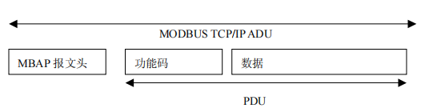

[toc]

# Modbus

## 1 Modbus

### 1.1 背景

Modbus协议是由MODICON在1979年开发的，是全球第一个真正用于工业现场的总线协议。

Modbus协议是应用月电子控制器上的一种通用语言。通过此协议，可以实现控制器之间、控制器经由网络和其他设备之间的通信。此协议定义了一个控制器能够认识使用的消息结构，而不管他们是经过何种网络进行通信的；描述了控制器请求访问其他设备的过程，如何应答来自其他设备的请求，以及怎样侦测错误；并制定了统一的消息域的结构和内容。

Modbus通信协议具有以下几个特点 ：

- Modbus协议标准开放、公开发表并无版税要求
- Modbus协议可以支持多种电气接口，还可以在各种介质上传输
- Modbus协议消息帧格式简单、紧凑、通俗易懂。

### 1.2 模型

MODBUS 是 OSI 模型第 7 层上的应用层报文传输协议，它在连接至不同类型总线或网络的设备之间提供主站设备 / 从站设备（或客户机 / 服务器）通信。互联网组织规定并保留了 TCP/IP 栈上的系统 502 端口用于访问 Modbus。

### 1.3 协议版本

Modbus通信协议目前存在用于串行链路、TCP/IP以太网以及其他支持互联网协议的网络版本。大多数Modbus设备通信通过串口（RS232/RS485）或者TCP/IP物理层进行连接。

串行链路通信（Serial Communication）：RTU模式 和 ASCII模式，

两种模式的主要区别是传输数据的字节表示上不同。

- ModbusRTU模式是一种紧凑的，采用二进制表示数据的方式；ModbusASCII模式是一种人类可读的、冗长的表示方式

为了保证数据传输的完整性和准确性：

- RTU模式下消息格式命令和数据带有循环冗余校验的校验和
- ASIIC模式下信息格式采用纵向冗余校验和

不同模式的节点间不能通信。

对于通过TCP/IP物理层的连接（例如以太网），连接多个Modbus/TCP变种，这种方式不需要校验和的计算。

对于以上3种通信模式，在数据模型和功能调用上都是相同的，只有传输报文封装方式是不同的。

### 1.4 通信设备

通常情况下，Modbus协议是一个主/从（master/slave）或客户端/服务器（Client/Server）架构的协议。通信网络中有一个节点为Master节点，其他为Slave节点，每一个Slave设备都有一个唯一的地址。

一个Modbus命令包含了准备执行指令的设备的Modbus地址，线路上所有的设备都会收到命令，但只有指定地址的设备会执行并回应指令。（地址0例外，地址0为广播地址，所有收到指令的设备都会运行，不过不用回应指令）

### 1.5 事务处理

Modbus是一个请求/应答协议，并且提供统一的功能码用于数据传输服务，Modbus功能码是Modbus请求/应答PDU（protocal data unit,协议数据单元）的元素之一，所谓的PDU是Modbus协议定义的一个与基础通信层无关的简单协议数据单元。在特定总线和网络上，Modbus协议则通过ADU（application data unit,应用数据单元）引入了一些附加域，以实现完整准确的数据传输。

通信格式：

- PDU模型：功能码 + 数据
- ADU模型：地址域 + 功能码 + 数据 + 差错校验

Modbus事务处理的过程如下：

主机设备（或客户端）创建Modbus应用数据单元形成查询报文，其中功能码标识了向从机设备（或服务器）指示将执行哪种操作。

- 功能码占用一个字节，有效的码字范围是十进制1~255，其中128 ~ 255为异常响应保留。

查询报文创建完毕，主机设备（或客户端）向从机设备发送报文，从机设备（或服务器端）接受报文后，根据功能码做出相应的动作，并将响应报文返回给主机设备（或客户端）。

正常响应：

如果出现与请求Modbus功能有关的差错，那么响应报文的功能码将包括一个异常码，主机设备能够根据异常码来确定下一个执行的操作。对于异常响应，从机设备将返回一个与原始功能码等同的码值，但设置该原始功能码的最高有效位为逻辑1，用于通知主机设备。

事务处理状态图：

## 2 Modbus协议

### 2.1 协议概要

Modbus是一种单主/多从的通信协议，在同一时间内，总线上只能有一个主设备，可以有一个或多个（最多247）从设备。每个从设备必须有唯一的地址（地址范围1 ~ 247），这样才能区别于其他从设备而被独立寻址，主设备不占用地址。

Modbus协议通信总是由主设备发起，当从设备没有收到来自主设备的请求时，不会主动发送数据，并且从设备之间不能相互通信，主设备同时只能启动一个Modbus访问事务处理。

主设备可以采用两种方式向从设备发送Modbus请求报文：单播 和 广播

- 单播：主设备仅寻址单个从设备，从设备接收并处理请求后，向主设备返回一个响应报文，即应答。这种模式下，一个Modbus事务处理包含两个报文：一个是主设备的请求报文，一个是从设备的响应报文。
- 广播：主设备向所有的从设备发送请求指令，而从设备接收广播指令后，仅需要进行相关指令的事务处理而不需要返回应答，基于此，广播模式下，请求指令必须是Modbus标准功能中的写指令。

Modbus协议要求，所有从设备必须接收广播模式下的写指令，且地址0保留并用作识别广播通信。此外，对于同一网络或链路来说，所有的设备必须保持统一的传输帧模式，ASIIC模式或者RTU格式，不能共存。

Modubs请求应答周期：

### 2.2 寄存器

Modbus中所有的数据存放在寄存器中，根据存放的数据类型以及各自读写特性，将寄存器分为4个部分，这4个部分可以连续也可以不连续。

Modbus寄存器地址分配：

表中PLC地址可以理解为Modbus协议地址的变种，一般采用10进制描述。寄存器Modbus协议地址指的是通信时使用的寄存器寻址地址，一般用16进制表示。

### 2.3 功能码

Modbus功能码占用一个字节，取值范围为1 ~ 127 ，127以上不能使用。Modbus规定==0x80==（十进制128）表示异常状态，129 - 255表示异常码。

Modbus标准协议中规定了3类Modbus功能码：公共功能码、用户自定义功能码、保留功能码

**公共功能码**

- 是较好地被定义的功能码，

- 保证是唯一的， 

- MODBUS 组织可改变的， 

- 公开证明的， 

- 具有可用的一致性测试， 

- MB IETF RFC 中证明的，

- 包含已被定义的公共指配功能码和未来使用的未指配保留供功能码。 

**用户定义功能码**

- 有两个用户定义功能码的定义范围，即 65 至 72 和十进制 100 至 110。 
- 用户自定义，不保证唯一性
- 如果用户要重新设置功能作为一个公共功能码，那么用户必须启动 RFC，以便将改变引入。 

**保留功能码**

- 一些公司对传统产品通常使用的功能码，并且对公共使用是无效的功能码。 

Modbus部分功能码：

功能码可分为位操作和字操作两类，位操作的最小单位为1位(bit)，字操作最小单位为2个字节。

- 位操作：读线圈状态0x01,写多个线圈0x0f
- 字操作指令：读保持寄存器0x03,写多个寄存器0x10

### 2.4异常码

#### 2.4.1 通信状况

​    当主机向设备发送命令后，可能会出现以4下种情况：

- 正常接收，正常处理，返回正常响应报文
- 因通信错误等原因，从站设备未收到查询报文，主站设备按超时处理。
- 从站接收到了查询报文，但报文存在通信错误（奇偶校验、LRC、CRC等等），那么从站丢弃该报文，不返回响应，主机设备按超时处理。
- 从站设备接收到正确的报文，但是超过处理范围（不存在的功能码或寄存器等），此时从站设备返回包含异常码的响应报文

#### 2.4.2 响应类型

  根据服务器处理结果，可以建立两种类型的响应：

- 一个正常modbus应答帧
  - 功能码域： 响应功能码 = 请求功能码
  - 数据域：     请求中要求的任何数据
  - 校验码：      响应帧自身计算

|   从站地址   |                 功能码                 |         数据         | 校验码（低位） | 校验码（高位） |
| :----------: | :------------------------------------: | :------------------: | :------------: | :------------: |
| 从站自身地址 | 与请求功能码保持一致（范围：0x00-0x7f) | 请求中要求的任何数据 |       XX       |       XX       |

- **一个异常MODBUS应答帧**：

  - 用来为客户机提供处理过程中与被发现的差错相关的信息

  - 功能码域：响应功能码 = 请求功能码 + ==0x80==（==即功能码最高位置为1==）

  - 数据域：提供一个异常码来指示差错原因

  - 校验码：响应帧自身计算

|   从站地址   |        功能码         |  数据  | 校验码（低位） | 校验码（高位） |
| :----------: | :-------------------: | :----: | :------------: | :------------: |
| 从站自身地址 | 请求功能码 + ==0x80== | 异常码 |       XX       |       XX       |

## 3 功能码

Modbus协议规定的PDU中，所有线圈或寄存器地址从0开始计算。

Modbus协议规定，起始地址由2个字节构成，取值范围为0x0000 ~ 0xFFFF。线圈数量由2个字节构成取值范围为 0x0001 ~ 0x07D0（即十进制1 ~ 2000）

### 0x01

0x01用于读取从设备的==线圈状态==，即各DO（discrete output，离散输出）的ON/OFF状态。

- 请求帧格式

  | 从站地址 | 功能码 | 起始地址（高位） | 起始地址（低位） | 数量（高位） | 数量（低位） | 校验码（低位） | 校验码（高位） |
  | :------: | :----: | :--------------: | :--------------: | :----------: | :----------: | :------------: | :------------: |
  |   0x03   |  0x01  |       0x00       |       0x13       |     0x00     |     0x1B     |       XX       |       XX       |

**含义：**

目标所在从站：0x03（3号）

命令：0x01（读线圈状态）

寄存器种类：线圈状态

目标起始索引地址：0x0013（索引地址 = 19）

目标起始PLC地址： 00001 + 19 = 00020（线圈状态PLC地址范围：00001-09999）

读取线圈数量：0x1B（1B = 27个，即27bit数据）

目标线圈范围：00020 - 00046（从00020开始27个线圈）

校验码：XXXX

- 正常应答帧格式

| 从站地址 | 功能码 | 字节计数 | 字节一 | 字节二 | 字节三 | 字节四 | 校验码（低位） | 校验码（高位） |
| :------: | :----: | :------: | :----: | :----: | :----: | :----: | :------------: | :------------: |
|   0x03   |  0x01  |   0x04   |  0xCD  |  0x6B  |  0xB2  |  0x05  |       YY       |       YY       |

**含义：**

返回从3号从站读取的共4个字节的数据，数据为：0xCD、0x6B、0xB2、0x05，校验码为YYYY。

**补充：**

由于读取的是线圈（bit)，若读取的个数不为8的倍数，比如这次读27bit，则取整数字节4字节32bit返回，剩余5bit用0补全。

### 0x03

该功能码用于读取从设备==保持寄存器==的内容，不支持广播模式，消息帧中指定了需要读取的保持寄存器的起始地址和数目。

- 请求帧格式

| 从站地址 | 功能码 | 起始地址（高位） | 起始地址（低位） | 数量（高位） | 数量（低位） | 校验码（低位） | 校验码（高位） |
| :------: | :----: | :--------------: | :--------------: | :----------: | :----------: | :------------: | :------------: |
|   0x03   |  0x03  |       0x00       |       0x06       |     0x00     |     0x02     |       XX       |       XX       |

**含义：**

目标所在从站：0x03（3号）

命令：0x03（读保持寄存器）

寄存器种类：保持寄存器

目标起始索引地址：0x0006（索引地址 = 6）

目标起始PLC地址： 40001 + 6 = 40007（保持寄存器PLC地址范围：40001-49999）

读取寄存器数量：0x02（02 = 2个，即2×2byte = 4byte数据）（一个寄存器为2字节）

目标线圈范围：40007-40008（从40007开始2个寄存器）

校验码：XXXX

- 正常应答帧

| 从站地址 | 功能码 | 字节计数 | 字节一（高位） | 字节一（低位） | 字节二（高位） | 字节二（低位） | 校验码（低位） | 校验码（高位） |
| :------: | :----: | :------: | :------------: | :------------: | :------------: | :------------: | :------------: | :------------: |
|   0x03   |  0x03  |   0x02   |      0xA1      |      0x05      |      0x04      |      0xCD      |       YY       |       YY       |

**含义：**

返回从3号从站读取的共2个寄存器的数据，数据为：0xA105（40007上的数据）、0x04CD（40008上的数据），校验码为YYYY。

### 0x0f

该功能码用于将连续的多个线圈或离散输出设置为ON/OFF状态，支持广播模式，广播模式下，所有从站设备的同一地址的值将被同一修改。

起始地址由2字节构成，取值范围为0x0000 - 0xFFFF，寄存器数量由2字节构成，取值范围为0x0001 ~ 0x07B0

- 正常请求帧

| 从站地址 | 功能码 | 起始地址（高位） | 起始地址（低位） | 数量（高位） | 数量（低位） | 字节数 | 字节一 | 字节二 | 字节三 | 校验码（低位） | 校验码（高位） |
| :------: | :----: | :--------------: | :--------------: | :----------: | :----------: | :----: | :----: | :----: | :----: | :------------: | :------------: |
|   0x01   |  0x0f  |       0x00       |       0x13       |     0x00     |     0x15     |  0x03  |  0x12  |  0x1A  |  0x04  |       XX       |       XX       |

**含义：**

目标所在从站：0x01（1号）

命令：0x0f（写多个线圈）

寄存器种类：线圈

目标起始索引地址：0x0013（索引地址 = 19）

目标起始PLC地址： 00001 + 19 = 00020（线圈状态PLC地址范围：00001-09999）

写入线圈数量：0x15（0x15 = 21bit数据）

实际写入线圈数量：21bit + 3bit = 24bit = 3byte（只能

目标线圈范围：00020-00040（从00020开始21个线圈）

字节一的值：0x12（0x12 = 18 = 0001 0010）

字节二的值：0x1A（0x1A = 26 = 0001 1010）

字节三的值：0xAC（0x04 = 4 = 0000 0100）（最高三位为补0）

校验码：XXXX

若写入的线圈个数不为8的倍数，则高位补0使其字节数为整数。

- 正常应答帧（在原报文基础上除去字节数和具体字节并加上当前校验码）

| 从站地址 | 功能码 | 起始地址（高位） | 起始地址（低位） | 数量（高位） | 数量（低位） | 校验码（低位） | 校验码（高位） |
| :------: | :----: | :--------------: | :--------------: | :----------: | :----------: | :------------: | :------------: |
|   0x01   |  0x0f  |       0x00       |       0x13       |     0x00     |     0x15     |       YY       |       YY       |

**含义：**

向1号从站起始地址为00020处写入21个线圈的值成功，校验码为YYYY。

### 0x10

该功能码用于写入从设备保持寄存器的多个连续地址块（1-123个寄存器），支持广播模式，在广播模式下，所有从站设备的同一地址的值将被统一修改。

本功能码中：起始地址由2个字节构成，取值范围为0x0000 ~ 0xFFFF,寄存器的数量字段由2个字节构成，取值范围为 0x0001 ~ 0x007B

- 请求帧格式

| 从站地址 | 功能码 | 起始地址（高位） | 起始地址（低位） | 数量（高位） | 数量（低位） | 字节数 |    字节    | 校验码（低位） | 校验码（高位） |
| :------: | :----: | :--------------: | :--------------: | :----------: | :----------: | :----: | :--------: | :------------: | :------------: |
|   0x01   |  0x10  |       0x00       |       0x53       |     0x00     |     0x02     |  0x04  | 0x13141A1B |       XX       |       XX       |

**含义：**

目标所在从站：0x01（1号）

命令：0x10（写多个保持寄存器）

寄存器种类：保持寄存器

目标起始索引地址：0x0053（索引地址 = 83）

目标起始PLC地址： 40001 + 83 = 40084（线圈状态PLC地址范围：40001-49999）

写入寄存器数量：0x02（02 = 2个，即2×2byte = 4byte数据）（一个寄存器为2字节）

目标寄存器范围：40084-40085（从40084开始2个保持寄存器）

写入字节数：0x04（4个）

写入字节内容：0x13141A1B（40084保持寄存器写入0x1314 = 0001 0011 0001 0100 ，40085保持寄存器写入0x1A1B = 0001 1010 0001 1011）

校验码：XXXX

- 正常应答帧格式

| 从站地址 | 功能码 | 起始地址（高位） | 起始地址（低位） | 数量（高位） | 数量（低位） | 校验码（低位） | 校验码（高位） |
| :------: | :----: | :--------------: | :--------------: | :----------: | :----------: | :------------: | :------------: |
|   0x01   |  0x10  |       0x00       |       0x53       |     0x00     |     0x02     |       YY       |       YY       |

**含义：**

向1号从站的40084位置开始写入两个保持寄存器成功，校验码为YYYY。

# 通信

## 串行链路通信：

### RTU

**编码系统**：8位二进制，每个8位字节含有两个4位十六进制字符

- **字节格式（11位）**

  有校验：1个起始位，8个数据位，1个奇偶校验位，1个停止位

  无校验：1个起始位，8个数据位，2个停止位

- **串行发送字符**：从左到右：最低有效位（LSB）.......最高有效位（MSB）

- **校验（奇校验ODD、偶校验EVEN和无校验NONE）**

  默认校验模式必须是偶校验，为了保证和其他产品的兼容性，建议使用无校验。

  如果使用无校验，那么多附加一个停止位来满足定长11位异步字符。

帧格式（最大256字节）

| ==地址== | ==功能码== |  数据  | ==CRC校验== |
| :------: | :--------: | :----: | :---------: |
|  1字节   |   1字节    | N 字节 |    2字节    |

帧判断

- 结束判断：用时长至少为3.5个字符时间的空闲间隔将报文帧区分开，如果3.5个字符时间未接收到字符，则视为该帧结束。

  

- 完整性判断：用1.5个字符时间判断帧的完整性，如果两个字符之间的空闲间隔大于1.5个字符时间，那么认为报文帧不完整，接收站丢弃这个报文帧。

  

- 帧校验（CRC循环冗余校验，2字节，检验整个报文内容）：发送方计算CRC的值并附加到帧尾，接收报文的过程中，接收设备重新计算CRC的值，并将计算的结果和接收到的CRC比较；若不相等，则产生了错误。

### ASCII

用两个ASCII码字符发送报文中的一个8位字节，当通信链路或者设备不能满足RTU模式的定时管理要求时使用。

**编码系统**：十六进制，ASCII字符0-9，A-F，报文中每个ASCII字符表示一个十六进制字符

- **字节格式（10位）**

  有校验：1个起始位，7个数据位，1个奇偶校验位，1个停止位

  无校验：1个起始位，7个数据位，2个停止位

- **串行发送字符**：从左到右：最低有效位（LSB）.......最高有效位（MSB）

- **校验（奇校验ODD、偶校验EVEN和无校验NONE）**

  默认校验模式必须是偶校验，为了保证和其他产品的兼容性，建议使用无校验。

  如果使用无校验，那么多附加一个停止位来满足定长**10位**异步字符。

  

  

帧格式（最大513字节）

|      起始      | 地址  | 功能码 |    数据     | LRC校验 |          结束           |
| :------------: | :---: | :----: | :---------: | :-----: | :---------------------: |
| 1字符 ':' | 2字符 | 2字符  | 0-2×252字符 |  2字符  | 2字符（回车换行CR，LF） |

一个报文必须以一个冒号（：）字符（十六进制ASCII 3A）作为起始，以回车换行（CRLF）（十六进制ASCII 0D和0A）作为结束。

报文中字符间时间间隔不能超过1s，除非配置了更长时间的超时，例如广域网应用可以要求4-5s超时，若超时，则表示已经出现错误。

**帧校验（LRC纵向冗余校验）**

校验内容不包括起始符和结束符

对报文中除起始符和结束符外的所有连续的8位字节相加，忽略任何进位，然后求其二进制补码得到LRC

LRC的结果也被编码为2个ASCII码字符。

### Modbus Plus

Modbus是一种通讯结构，广泛应用在智能设备之间进行主-从方式通讯。一个Modbus信息桢包括从机地址、功能码、数据区和数据校验码。正因为 Modbus仅仅定义了通讯结构，所以可以使用RS232、RS422和RS485端口，可以使用光纤、无线等媒质实现通讯。

而 Modbus Plus则是一种典型的令牌环网，完整定义了通讯协议、网络结构、连接电缆（或者光缆）以及安装工具等方面的性能指标。

Modbus+网络中的设备通过‘令牌’的方式实现数据的交换， 严格定义了令牌的传递方式，数据校验以及通讯短口等方面的技术参数。

MODBUS PLUS比MODBUS的性能更好，通讯速率快，从协议开发上来说区别较大，modbus比较简单。

## 以太网通信

### TCP

​    在TCP/IP上使用一种专用报文头来识别Modbus应用数据单元==ADU==，即**MBAP报文头**。

- 用MBAP报文头中的**单个字节单元标识符**取代MODBUS串行链路上通常使用的MODBUS**从站地址域**。这个单元标识符用于设备的通信，这些设备使用单个 IP 地址支持多个独立MODBUS 终端单元，例如：网桥、路由器和网关。
- 用接收者可以验证完成报文的方式设计所有 MODBUS 请求和响应。对于 MODBUS PDU有固定长度的功能码来说，仅功能码就足够了。对于在请求或响应中携带一个可变数据的功能码来说，数据域包括字节数。
- 当在 TCP 上携带 MODBUS 时，即使将报文分成多个信息包来传输，办事在 MBAP 报文头上携带**附加长度信息**，以便接收者能识别报文边界。显式和隐式长度规则的存在以及**CRC-32 差错校验码**的使用（在以太网上）将对请求或响应报文产生极小的未检出干扰。

**MBAP报文头格式（长7字节）：**

- 事务元处理标识符：用于事务处理配对。在响应中，MODBUS 服务器复制请求的事务处理标识符。
- 协议标识符：用于系统内的多路复用。通过值 0 识别 MODBUS 协议。
- 长度：长度域是下一个域的字节数，包括单元标识符和数据域。
- 单元标识符：为了系统内路由，使用这个域。专门用于通过以太网 TCP-IP 网络和 MODBUS 串 行链路之间的网关对 MODBUS 或 MODBUS+串行链路从站的通信。MODBUS 客户机在请求中设置 这个域，在响应中服务器必须利用相同的值返回这个域。

**MODBUS TCP/IP帧格式：**

协议数据单元前加MBAP报文头，没有了校验码，其他数据格式相同

请求帧格式：

| 事务元处理标识符（高位） | 事务元处理标识符（低位） | 协议标识符（高位） | 协议标识符（低位） | 长度（高位） | 长度（低位） | 单元标识符 | 功能码 | 起始地址（高位） | 起始地址（低位） | 寄存器数量（高位） | 寄存器数量（低位） |
| :----------------------: | :----------------------: | :----------------: | :----------------: | :----------: | :----------: | :--------: | :----: | :--------------: | :--------------: | :----------------: | :----------------: |
|           0x15           |           0x01           |        0x00        |        0x00        |     0x00     |     0x06     |    0xFF    |  0x03  |       0x00       |       0x06       |        0x00        |        0x02        |

正常应答帧格式：

| 事务元处理标识符（高位） | 事务元处理标识符（低位） | 协议标识符（高位） | 协议标识符（低位） | 长度（高位） | 长度（低位） | 单元标识符 | 功能码 | 字节计数 | 字节一（高位） | 字节一（低位） | 字节二（高位） | 字节二（低位） |
| :----------------------: | :----------------------: | :----------------: | :----------------: | :----------: | :----------: | :--------: | :----: | :------: | :------------: | :------------: | :------------: | :------------: |
|           0x15           |           0x01           |        0x00        |        0x00        |     0x00     |     0x06     |    0xFF    |  0x03  |   0x02   |      0xA1      |      0x05      |      0x04      |      0xCD      |

TCP/IP是一个协议簇，里面包括很多协议。

TCP（Transmission Control Protocol，传输控制协议）是面向连接的协议，即在收发数据钱 ，都需要与对面建立可靠的链接,即三次握手以及TCP的四次挥手！

​	三次握手：建立一个TCP连接时，需要客户端和服务端总共发送3个包以确认连接的建立， 在Socket编程中，这一过程由客户端执行connect来触发，具体流程如下：

* **第一次握手**：Client将标志位SYN置为1，随机产生一个值seq=J，并将该数据包发送给Server， Client进入SYN_SENT状态，等待Server确认
* **第二次握手**：Server收到数据包后由标志位SYN=1知道Client请求建立连接，Server将标志位 SYN和ACK都置为1，ack=J+1，随机产生一个值seq=K，并将该数据包发送给Client以确认连接请求 ，Server进入SYN_RCVD状态。
* **第三次握手**：Client收到确认后，检查ack是否为J+1，ACK是否为1，如果正确则将标志位ACK 置为1，ack=K+1，并将该数据包发送给Server，Server检查ack是否为K+1，ACK是否为1，如果正确则 连接建立成功，Client和Server进入ESTABLISHED状态，完成三次握手，随后Client与Server之间可以 开始传输数据了。

​	四次挥手：所谓四次挥手（Four-Way Wavehand）即终止TCP连接，就是指断开一个TCP连接时，需要客户端和服务端总共发送4个包以确认连接的断开。在socket编程中，这一过程由客户端或服务端任一方执行close来触发，整个流程如下图所示：

* **第一次挥手**：Client发送一个FIN，用来关闭Client到Server的数据传送，Client进入FIN_WAIT_1状态
* **第二次挥手**：Server收到FIN后，发送一个ACK给Client，确认序号为收到序号+1（与SYN相同，一个FIN占用一个序号），Server进入CLOSE_WAIT状态
* **第三次挥手**：Server发送一个FIN，用来关闭Server到Client的数据传送，Server进入LAST_ACK状态
* **第四次挥手**：Client收到FIN后，Client进入TIME_WAIT状态，接着发送一个ACK给Server，确认序号为收到序号+1，Server进入CLOSED状态，完成四次挥手

# 人机界面

​		人机界面又称用户界面或使用者界面，是人与计算机之间传递、交换信息的媒介和对话接口，是计算机系统的重要组成部分。是系统和用户之间进行交互和信息交换的媒介，它实现信息的内部形式与人类可以接受形式之间的转换。凡参与人机信息交流的领域都存在着人机界面。

就对于此次实现的四个主从站的UI界面而言

* 本次实现主要是通过QT来设计用户界面；UI设计是指对软件的人机交互、操作逻辑、界面美观的整体设计。

* 设计原则为：
  * 按照用户需求实现基础界面设计。
  * 结合具体使用功能要求，设计了易于维护、分辨等特点的界面，从而提高其友好交互性和易操作性。
  * 操作界面分模块化实现，易懂、简洁、实用；色彩一致，提高使用时的舒适度。
  * 按照操作人员的身份特征和工作性质，设计与之相适应和友好的人机界面。根据其工作需要，宜以弹出式窗口显示提示、引导和帮助信息 ，从而提高用户的交互水平和效率。

